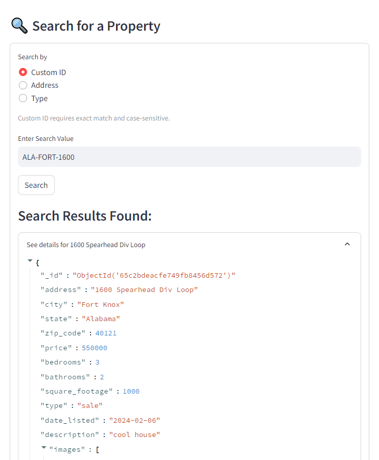
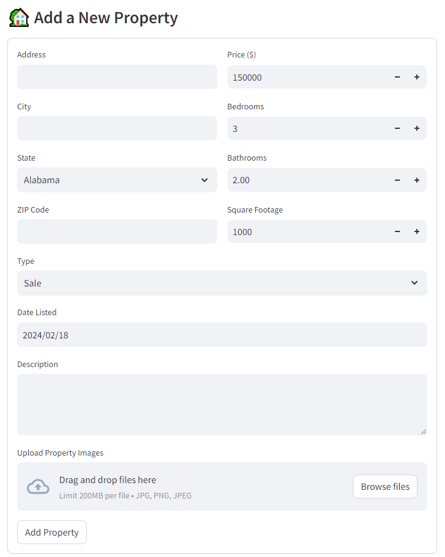
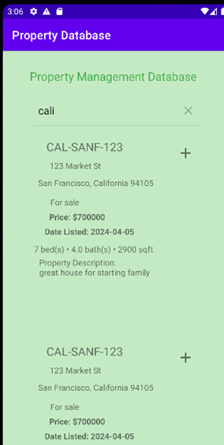

# Real Estate Data Management System

The project is a distributed data management system for real estate data. It consists of three main components.

## Roadmap

- backend: interacts with MongoDB database for managing property data

- frontend: uses Streamlit to provide a web interface for users to interact with the property data

- property-management-app: Android application integrated with MongoDB database through Flask API for users to browse real estate listings

  

